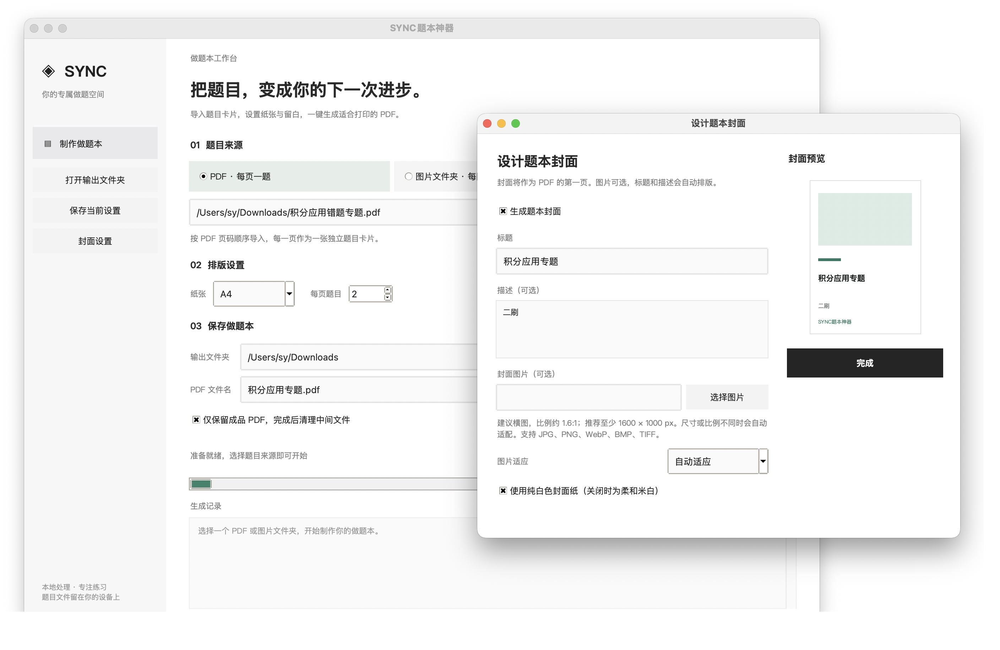
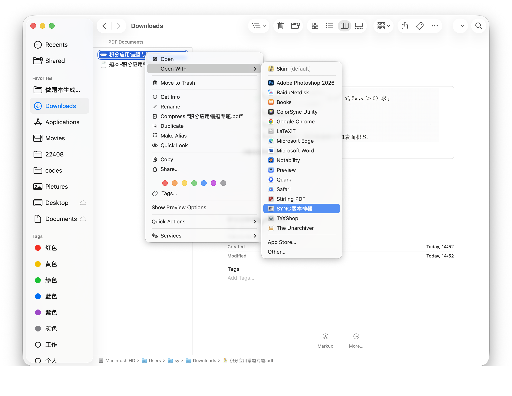

## SYNC题本神器

<div align="center">
  
</div>

> 将 PDF 或图片文件夹中的题目卡片，一键排版为适合打印的做题本。支持 MarginNote 导出的卡片 PDF、自行整理的题目截图，以及 A4、B5、A5 等纸张。
> 生成的pdf格式可以用于打印为纸质版的错题本，从而提高刷错题的效率🚀。


**现代化清爽界面**



右键pdf打开，无弹窗极速生成题本，效率拉满。



最新版采用简洁浅色工作台，支持切换 PDF 和图片文件夹两种题目来源；右侧展示排版示意。


可以用于：
- PDF 输入：每一页是一张独立题目卡片，按页码顺序排版。
- 图片文件夹输入：每个图片文件是一张独立题目卡片，支持 JPG / JPEG / PNG / WebP / BMP / TIFF。
- 文件名自然排序：`1.png、2.png、10.png`，仅读取所选文件夹的直接子文件；多帧图片只使用第一帧。
- 自动校正照片 EXIF 方向，透明图片使用白色底色。
- 类 GPT 的简洁浅色界面：侧栏、来源切换、实时排版示意、生成状态和日志。
- 可选题本封面：自定义标题、描述与封面图片；封面自动作为 PDF 第一页。
- 导出错题集为错题本。
- 自定义每一面题目的数量。
- 可选的的题本尺寸预设（A4、B5等）
- 可选的「只生成 PDF 文件」模式：跑完自动删除 pages/、layout/ 中间文件夹，输出目录只留成品PDF。

<table align="center" width="100%">
  <tr>
    <td align="center" width="33.33%">
      
      <br/>
      <b>选中卡片导出</b>
    </td>
    <td align="center" width="33.33%">
      
      <br/>
      <b>导出为pdf</b>
    </td>
    <td align="center" width="33.33%">
      
      <br/>
      <b>分享并保存pdf</b>
    </td>
  </tr>
</table>

使用新版界面：

1. macOS 双击项目内的 `start_gui.command`，或使用带 Tk 的 Python 运行 `pdf_maker_gui.py`。
2. 在「题目来源」选择「PDF · 每页一题」或「图片文件夹 · 每图一题」，选择对应文件或目录。
3. 选择纸张和每页题目数（1–12）。右侧示意会同步更新；题目在各自区域顶部对齐，下方留白，末页按剩余题数分配空间。
4. 如需封面，点击侧栏的「封面设置」，勾选「生成题本封面」，填写标题、可选描述，并可选择一张封面图片。没有图片时也会生成纯文字设计封面。
5. 设置输出文件夹和成品名称，点击「生成做题本」。界面会自动执行完整流程，无需手动选择步骤；选择 PDF 时成品名会默认跟随源文件名。生成成功后会自动打开输出文件夹。
6. 完成后通过侧栏「打开输出文件夹」查看成品。

生成的成品尺寸与所选纸张一致。开启封面后，它会成为 PDF 的第一页；标题最长 64 个字符，描述最长 240 个字符，封面图片支持 JPG、PNG、WebP、BMP、TIFF。封面设置中可选自动适应、裁切铺满或完整显示，建议图片比例约 1.6:1、尺寸至少 1600×1000 px，并可选纯白色封面纸。来源文件与成品不能同名同路径；图片源目录位于输出 `layout/` 内时会提示换一个输出目录，避免覆盖原图。加密 PDF 需要先解锁。右侧显示的是排版示意，不是题目内容预览。

命令行仍支持通过 `config.ini` 控制各步骤。在 `[路径设置]` 中设置 `输入类型 = pdf` 或 `输入类型 = folder`，并填写 `输入pdf文件` 或 `输入文件夹`。封面可在 `[封面设置]` 中通过 `生成封面 = true` 开启，并填写 `标题`、`描述`、`封面图片`。旧配置未填写输入类型时，会根据原「执行_pdf转图片」开关推断。GUI 会记住选择，并在下次生成前保存设置。

```sh
.venv/bin/python pdf_maker_gui.py --cli --config config.ini
```

修改源码后通过启动脚本运行即可体验新版。需要独立的 macOS 应用时，在 Finder 中双击项目根目录的 **`build_mac.command`**：

- 自动查找带 Tk 的 Python 3.13+，准备独立打包环境和依赖。
- 使用项目图标打包最新源码，校验签名与 Tcl/Tk 运行库。
- 使用打包后的应用分别验证 PDF、图片文件夹两种输入，检查成品页数、纸张尺寸及中间文件清理。
- 全部成功后更新 `dist/SYNC题本神器.app`，自动打开 `dist`。打包或自检失败时保留旧版应用；`dist` 内其它文件也会保留。

首次运行可能需要联网安装依赖。产物对应当前 Mac 的处理器架构；这不是跨架构打包或 Apple 公证流程。打包日志在 `build/packaging.log`。

也可在终端运行：

```sh
./build_mac.command
./build_mac.command --no-open   # 不自动打开 Finder
./build_mac.command --help      # 查看更多选项
```

之后每次改完源码，重新双击该脚本即可更新 `dist` 中的应用。

如果只想要最终成品，可勾选界面上的**「仅保留成品 PDF，完成后清理中间文件」**（对应 `config.ini` 里的 `[输出设置] 只生成pdf文件 = true`）：
合并PDF成功后会自动删除输出目录下的 `pages/`、`layout/` 中间文件夹，只留下最终 PDF。
该选项仅清理输出目录中的中间结果，不会动你自己的输入文件（输入PDF、输入文件夹在清理范围内时会自动跳过）。

完成后打开输出目录获得成品！~


1. mac系统：直接下载 [release](https://github.com/CCCCOOH/exercise-book-generator/releases/tag/mac)即可按照上述方式执行。
2. 非mac系统：

```sh
# 克隆本repo
git clone https://github.com/CCCCOOH/exercise-book-generator.git
# 请自行编译和安装依赖相关依赖...
```

开发验证（生成引擎需要 PyMuPDF / Pillow，GUI 测试需要带 Tk 的 Python）：

```sh
.venv/bin/python -m unittest discover -s tests -p 'test_inputs.py' -v
.venv/bin/python tests/test_only_pdf.py
/Library/Frameworks/Python.framework/Versions/3.13/bin/python3 -m unittest discover -s tests -p 'test_gui.py' -v
```


生成 macOS 安装包（PKG）：

在 Finder 中双击 **`build_pkg.command`**，脚本会先重新打包并自检最新版应用，再生成 `dist/SYNC题本神器.pkg`，完成后打开 `dist`。双击该 PKG，按照 macOS 安装器提示即可安装到 `/Applications/SYNC题本神器.app`。生成脚本不会自动安装，也不需要管理员权限；安装时由系统请求权限。

```sh
./build_pkg.command
./build_pkg.command --skip-app-build  # 直接使用 dist 中已经打包的应用
./build_pkg.command --no-open         # 不自动打开 Finder
./build_pkg.command --version 1.0.0   # 默认读取 pyproject.toml 的 version
./build_pkg.command --sign "Developer ID Installer: Your Name (TEAMID)"
```

PKG 会校验安装内容和安装器读取能力，成功后才替换旧安装包；日志位于 `build/pkg-packaging.log`。安装目标固定为“应用程序”，不会把应用安装到项目的 dist 副本位置。安装包架构与应用一致。

默认生成未签名 PKG，macOS 的安全策略可能要求用户确认或阻止安装。对外分发时可使用已有的 Developer ID Installer 证书签名；Apple 公证需另行完成，脚本不会自动申请证书或公证。


版本约定：以后“最新版”专指当前现代浅色 UI（`pdf_maker_gui.py`）。APP 与 PKG 均以此为唯一应用入口，不打包其它 UI 版本。

源码结构：根目录只保留 `pdf_maker_gui.py` 一个应用入口（现代浅色界面，也支持 `--cli`）。PDF 排版引擎放在 `core/pdf_engine.py`；`tests/` 保留功能验证用例，不是其它界面版本。原 `pdf_maker_app.py` 打包入口已合并到界面入口，APP 和 PKG 打包脚本均已同步。
