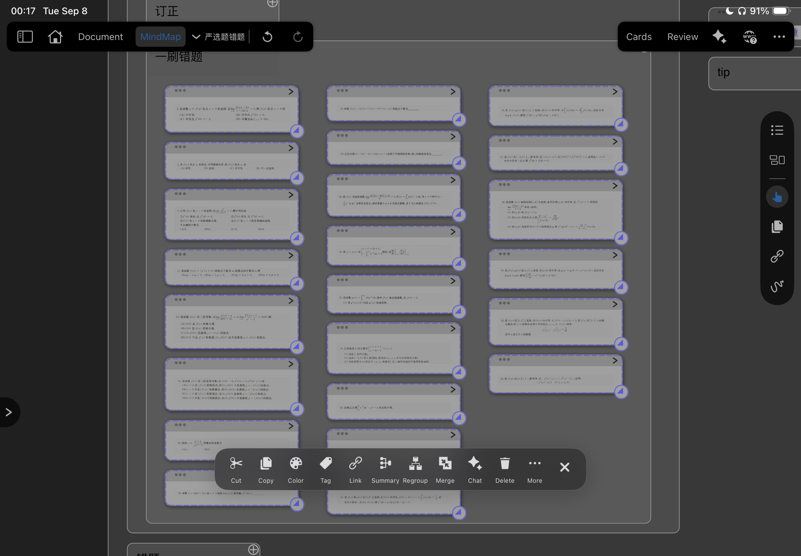
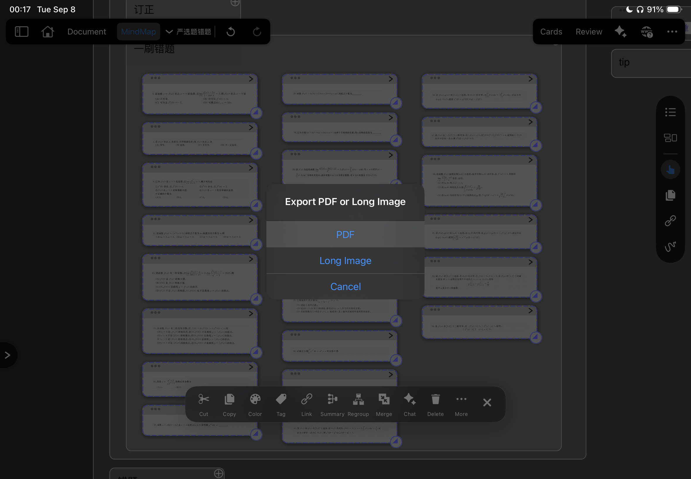
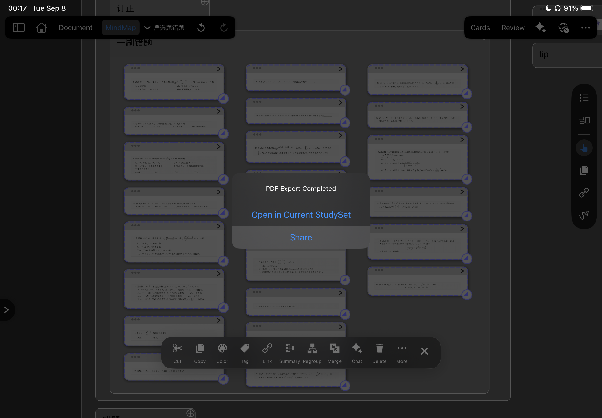
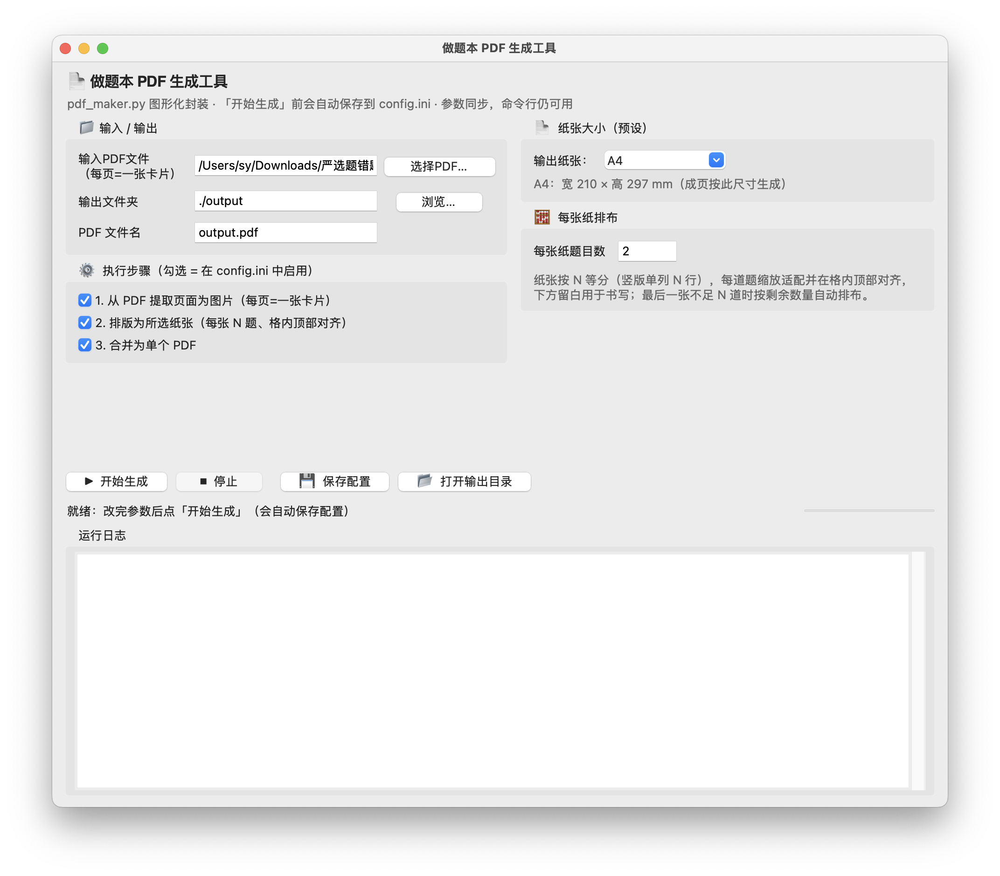
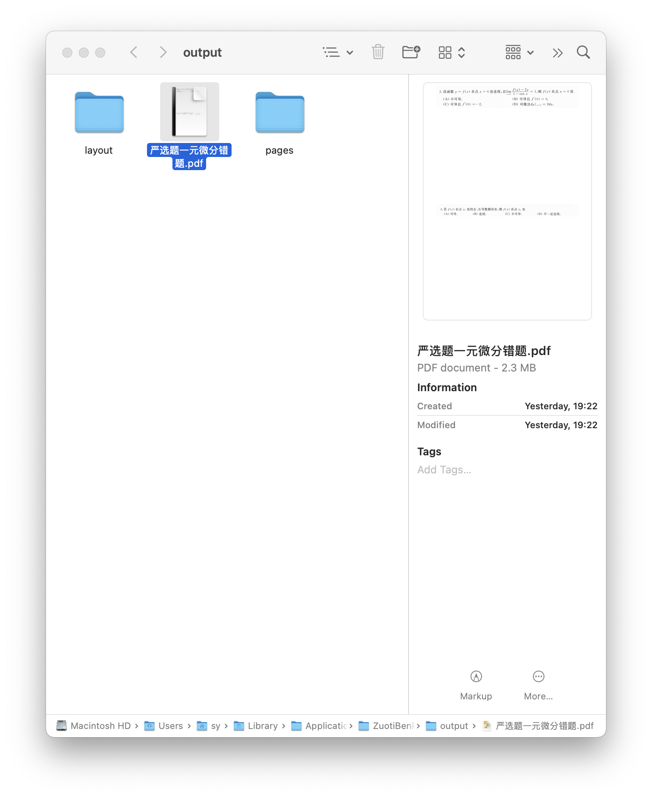
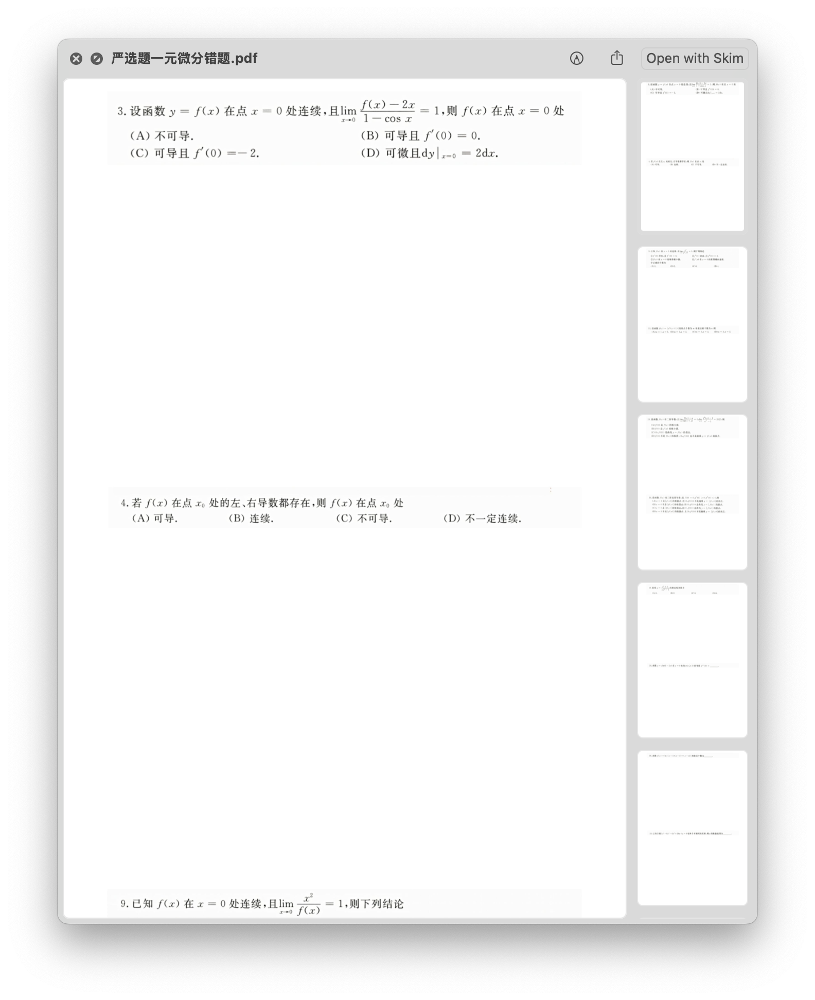

## SYNC 题本神器

<div align="center">
  
</div>

> 简介：由于MarginNote导出的卡片不符合A4格式，无法直接打印。本项目提供了对应的功能，通过python工作流实现将MarginNote导出的卡片pdf一键自动处理为可以用于打印的A4错题本，并支持调整页面可容纳的题目数量。
> 生成的pdf格式可以用于打印为纸质版的错题本，从而提高刷错题的效率🚀。

可以用于：
- 制作题本。
- 导出错题集为错题本。
- 自定义每一面题目的数量。
- 可选的的题本尺寸预设（A4、B5等）
- 可选的「只生成 PDF 文件」模式：跑完自动删除 pages/、layout/ 中间文件夹，输出目录只留成品PDF。

<table align="center" width="100%">
  <tr>
    <td align="center" width="33.33%">
      
      <br/>
      <b>选中卡片导出</b>
    </td>
    <td align="center" width="33.33%">
      
      <br/>
      <b>导出为pdf</b>
    </td>
    <td align="center" width="33.33%">
      
      <br/>
      <b>分享并保存pdf</b>
    </td>
  </tr>
</table>

选择MarginNote中导出的卡片集pdf作为`输入PDF文件`，选择纸张大小和每张纸的题目数量（越多越省纸，但空间更小）。

如果只想要最终成品，可勾选界面上的**「只生成 PDF 文件」**（对应 `config.ini` 里的 `[输出设置] 只生成pdf文件 = true`）：
合并PDF成功后会自动删除输出目录下的 `pages/`、`layout/` 中间文件夹，只留下最终 PDF。
该选项仅清理输出目录中的中间结果，不会动你自己的输入文件（输入PDF、输入文件夹在清理范围内时会自动跳过）。



完成后打开输出目录获得成品！~


<table align="center" width="100%">
  <tr>
    <td align="center" width="50%">
      
    </td>
    <td align="center" width="50%">
      
    </td>
  </tr>
</table>

1. mac系统：直接下载 [release](https://github.com/CCCCOOH/exercise-book-generator/releases/tag/mac)即可按照上述方式执行。
2. 非mac系统：

```sh
# 克隆本repo
git clone https://github.com/CCCCOOH/exercise-book-generator.git
# 安装依赖相关依赖...
```

> 由于本人手边暂时没有windows电脑，暂时没法儿给windows编译，非mac用户可以用Agent Harness或其他AI工具辅助完成环境的搭建。
